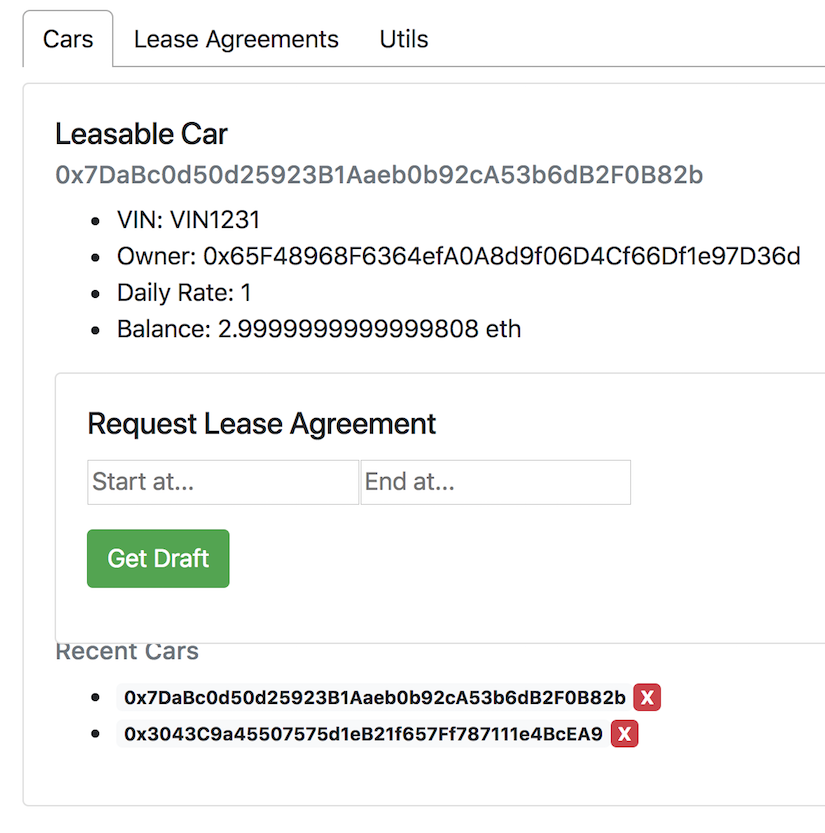
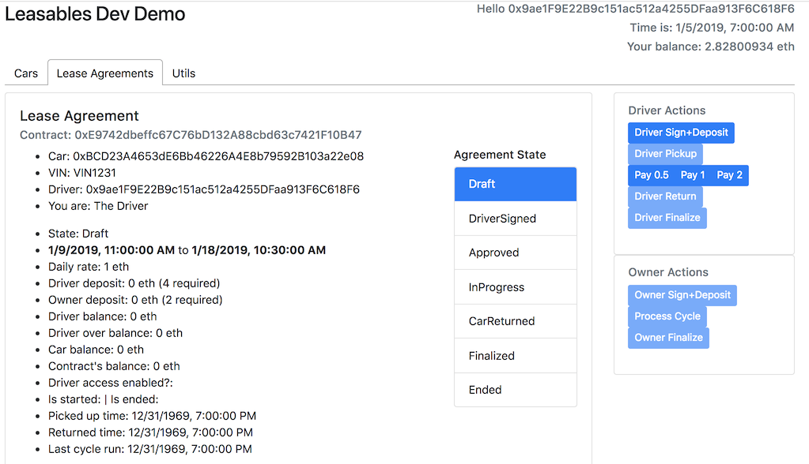
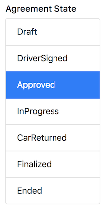
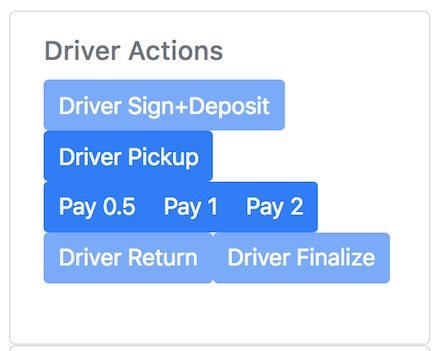
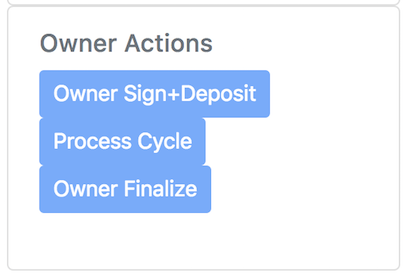

# Leasables Demo

NOTE: This demo UI is very rudimentary and not easy on the eyes. It has a data oriented user experience and often requires manual page refreshes since all back-end data changes are not always fully reflected on the UI immediately.

The UI is organized with 3 tabs: 
    1] Cars: Lookup existing cars and request draft lease agreements
    2] Lease Agreements: Lookup existing agreements, sign, deposit, process, return, finalize etc. 
    3] Utils: Connection status details, list of available accounts and a time machine (a tool for testing).
 
## Cars

Lookup an existing car by its address by using one of the sample cars created as part of the `truffle deploy` step in dev setup. Try `0xBCD23A4653dE6Bb46226A4E8b79592B103a22e08` or `0x8B207a3fc32ae8907966AB51C8079fD079C54ACA`

NOTE: The "Recent Cars" and "Recent Agreements" lists are for convenience only and the data is not stored on chain, just in local browser storage.

You can request a "Draft Lease Agreement" with a start & end date & time. It will display the address of the newly created agreement in a confirmation message. It will also be added to the "Recent Agreements" list

Switch over to the "Lease Agreements" tab to view it.

The details of the agreement are on the left side. The latest known state of the agreement: 

The driver's available actions based on the state of the agreement:

The owner's available actions based on the state of the agreement:

